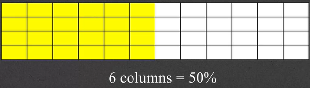
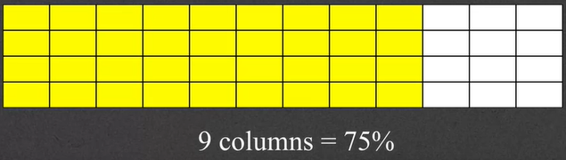
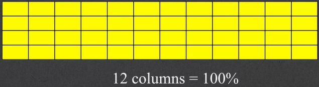
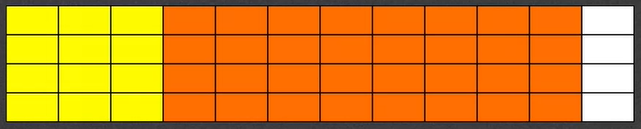

# 14 - Bootstrap Grid System

---

### It's not a table
- The Bootstrap layout is based on a 12 column grid
- 3 columns = 25%

- 6 columns = 50%

- 9 columns = 75%

- 12 columns = 100%


### Grid classes
- Every grid consists of:
    - A container
        - A row
            - One or more column classes

```html
<div class = "container">
    <div class = "row">
        <div class = "col-xx-yy">
        <!-- xx is viewport size, yy is the number of columns you want to use -->
```

### Settings width wtih col-xx-yy
- The class `col-xx-yy` always starts with "col"
- The "xx" component is the viewpoirt size:
    - `xs` (480)
    - `sm` (720)
    - `md` (992)
    - `lg` (1200)

- The "yy" component is the number of columns
    - 0 through 12

### col-xx-yy
- `col-xs-12`
    - If you're seeing this on an extra small screen, it should take the full width
- `col-sm-8`
    - Now we want to take 8 out of the 12 columns, but only on a small screen
- `col-md-4`
    - If I'm on a medium screen, I want to use up four columns (or 1/3rd of the entire screen size)
- `col-lg-3`
    - This is a large screen, let's just use 25% of the screen
- These are often combined! Think of photos
    ```html
    
    ```
    - Relatively big on a small screen, small on a larger screen

### Combining elements
- What if you want two elements next to each other, but only on larger screen?

```html
<div class = "col-xs-12 col-md-3">Yellow Part</div>
<div class = "col-xs-12 col-md-8">Orange Part</div>
```
- On an extra small screen, take up the entire width... but on a medium screen, only take 25%

### But it is actually easier than that...
- Because Bootstrap is mobile first, there is no need to specify the twelve columns if the element is block

```html
<div class = "col-xs-12 col-md-3">Yellow Part</div>
<!-- Since we are operating mobile first... col-xs-12 doesn't need to be defined.  -->
<div class = "col-md-3">Yellow Part</div>
```

### Positioning classes
- On viewports md and up, there is an option for push and pull classes
    - `col-xx-push-yy` - move yy columns to the right
    - `col-xx-pull-yy` - move yy columns to the left

### Responsive utility classes
- `hidden-xx` content will only be hidden on the xx screen size
- `visible-xx` content will only be visible on the xx screen size
- `sr-only` content is hidden on all devices except screen readers

### Conclusion
- Bootstrap is mobile first, larger screens inherit values from smaller screens
- Review [this site for examples](http://getbootstrap.com/examples/grid/)
- Do the math! If you want two elements to be next to eachother on a larger screen, make sure their width adds up to no more than 12